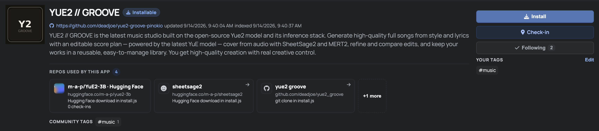
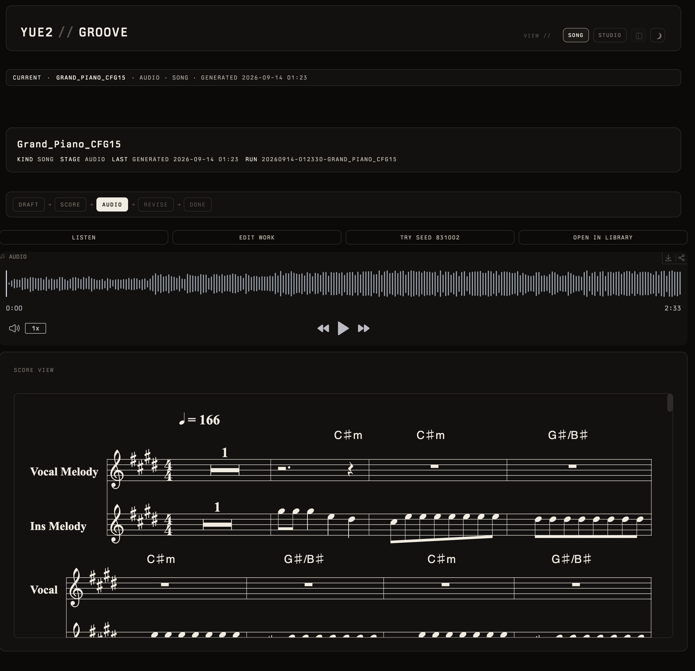

# YUE2 // GROOVE — Pinokio launcher

<p align="center">
  <a href="https://pinokio.computer"></a>
  <a href="https://github.com/multimodal-art-projection/YuE"></a>
  <a href="https://huggingface.co/m-a-p/SheetSage2"></a>
  
  
  <a href="LICENSE"></a>
</p>

YUE2 // GROOVE is the latest music studio built on the open-source Yue2 model and its inference stack. Generate high-quality full songs from style and lyrics with an editable score plan — powered by the latest YuE model — cover from audio with SheetSage2 and MERT2, refine and compare edits, and keep your works in a reusable, easy-to-manage library. You get high-quality creation with real creative control. Hardware: an NVIDIA GPU with 24 GB VRAM on Linux (YuE2's recommended setup, validated end-to-end here on an NVIDIA L4; a 16 GB memory budget completed a full-length song bit-identical to 24 GB) or an Apple Silicon Mac with 32 GB+ unified memory (where this app is developed and tested). Windows is not a supported platform: install, launch and Cover were verified once on Windows 11 (RTX 2070, 8 GB); song generation has not been run there and gets best-effort help only. YuE2 has no official quantized weights and Groove runs the unmodified BF16 model; a 12 GB memory budget needs the experimental FP8 mode (about 4x slower), and AR offload is unvalidated.

## What you get

1. **Install** clones groove, creates two Pinokio-managed Python environments, downloads YuE2 + SheetSage2 weights, and wires Cover.
2. **Start** opens the UI on `127.0.0.1` in the **SONG** view (Studio tabs including **02 // COVER** and **03 // EDIT** stay available).
3. **Update** pulls this launcher and the app, then refreshes both venvs; **Reset** wipes both venvs (clone, `models/`, and HF cache stay).

This is the complete app: YuE2 song generation **and** SheetSage2 Cover.

## Screenshots

**Pinokio Explore** — Installable app page:



**SONG** — start (NEW / COVER / EDIT):


**SONG** — after generate:



More UI shots live in the [yue2_groove README](https://github.com/deadjoe/yue2_groove#screenshots).


Install declares `requires.bundle = "ai"`. Pinokio installs its AI setup preset (conda, git, ffmpeg, uv, huggingface, …) automatically before the script runs. You do not install those by hand.

## Requirements

- [Pinokio Desktop](https://pinokio.computer)
- About 11 GB of disk for weights: YuE2-3B + VAE (7.8 GB), MERT-v2-FullSong (2.4 GB), SheetSage2 (0.2 GB) — all fetched by Install

### Hardware

- **macOS — tested.** Apple Silicon with **≥ 32 GB** unified memory. This is the platform the app and this launcher are developed and tested on (two 64 GB machines, M1 Max and M4 Pro).
- **Linux + NVIDIA — validated end-to-end.** GPU with BF16 and **≥ 24 GB** VRAM is YuE2 upstream's recommended configuration; the app was validated on an NVIDIA L4 (generation, memory budget, FP8 — see the app's [LINUX_CUDA.md](https://github.com/deadjoe/yue2_groove/blob/main/docs/LINUX_CUDA.md)). A full-length song peaks at about 10.5–10.8 GiB, and a **16 GB memory budget** completed the same song **bit-identical** to the 24 GB run; a physical 16 GB card has not been tested yet. Install puts the CUDA (cu128) torch build into the groove venv via `torch.js` and fails if `torch.cuda.is_available()` is still false.
- **Windows + NVIDIA — not a supported platform; best effort only.** Install, launch and Cover were verified once (Windows 11, RTX 2070 8 GB, 2026-09-15): `torch.js` puts `torch 2.10.0+cu128` in place of PyPI's CPU-only Windows wheel, `yue2 doctor` verifies the weights, and a SheetSage2 transcription runs on the GPU. Song generation has not been run on Windows, and YuE2 upstream does not list Windows as a supported platform. Known: the first user attempt hit an upstream FlashAttention check bug (`USE_FLASH_ATTENTION was not enabled for build`, fix pending in [YuE PR #166](https://github.com/multimodal-art-projection/YuE/pull/166)); the app now falls back to upstream's slower eager decoder on such hosts. A full-length song needs ~11 GB of VRAM regardless.

Memory is not enforced — install proceeds either way.

### Lower VRAM

YuE2 ships as one **unquantized BF16** model: the weights are 7.3 GB, and a measured full-length song (4:45, CFG 1.5) peaks at about **10.5–10.8 GiB** of VRAM including the KV cache, acoustic synthesis and VAE decode. There are **no official quantized weights**; community int8 / GGUF / MLX ports exist but are a different numerical configuration (see the [post on why Groove keeps the reference configuration](https://pinokio.co/posts/01m2qdmjd6b7apgg09mg9z9tv7)). What upstream offers, all reachable from the **Settings** rail:

- **MEMORY BUDGET** — a hard cap on the GiB YuE2 may allocate (`≤ 12` also halves the VAE decode window). **16 validated**: bit-identical output to 24 on an L4. **12 fails in BF16** for a full-length song (out of memory at the semantic stage).
- **QUANTIZATION = fp8** — upstream's experimental mode, AR linears only, needs an RTX 40-series or newer (compute capability ≥ 8.9); upstream makes no quality claim. Completes on a 12 GB budget at about 4× the generation time (measured on an L4).
- **OFFLOAD AR WEIGHTS** — moves the AR stack to CPU during acoustic synthesis. Unvalidated.

If you try these on a 12–16 GB card, reports are welcome.

## License notice

YuE2 / SheetSage2 / MERT **model weights** are **CC BY-NC 4.0 (non-commercial)** from their respective authors.  
This launcher and `yue2_groove` UI code are Apache-2.0. By installing you agree to use the weights only for non-commercial purposes.

## Install via Pinokio

**Easiest:** open the [app page on Pinokio](https://pinokio.co/apps/github-com-deadjoe-yue2-groove-pinokio) → **Install** → **Start**.

Or from Desktop:

1. Open Pinokio → **Explore** / Discover → search `YUE2 // GROOVE` (or **Download from URL**)
2. If using URL, paste:

   ```text
   https://github.com/deadjoe/yue2-groove-pinokio
   ```

3. Finish **Dev Setup** if it appears, then complete download
4. Click **Install** (AI bundle via `requires.bundle`, then weights)
5. Click **Start** → **Open Web UI**

> On a brand-new Pinokio home, prefer **Explore / Discover → Download from URL** (or the app-page Install). Avoid Create / Plugins → “Download from Git URL” — that Universal Launcher path can skip the bin seed and fail with `conda: command not found`.

## What Install does

| Step | Detail |
|---|---|
| AI bundle | `requires.bundle = "ai"` — Pinokio's own setup installs conda/git/ffmpeg/uv/huggingface (and CUDA on NVIDIA) before Install runs, as in every official launcher |
| Clone | `yue2_groove` → `app/` when `app/pyproject.toml` is missing |
| Groove venv | official `venv: "env"` — `uv pip install -e ".[yue2]"` with `overrides/{macos,linux}.txt` |
| CUDA torch | `torch.js` (Pinokio's standard pattern): on NVIDIA Linux/Windows reinstalls `torch==2.10.0` from the `cu128` index — PyPI's Windows wheel is CPU-only. No-op on macOS |
| SheetSage2 venv | official `venv: ".venv-sheetsage2"` + torch 2.8 |
| Weights | official `hf.download` for `m-a-p/SheetSage2` (to `app/models/SheetSage2`), `m-a-p/YuE2-3B`, `m-a-p/YuE2-Vae`; then the MERT-v2-FullSong snapshot pinned in SheetSage2's `config.json` (`base_model_revision`) into the HF cache |
| Verify | groove + yue2 + Gradio frontend; Cover venv imports torch/transformers; on NVIDIA, `torch.cuda.is_available()` must be true |

Cover needs no network after Install: Start passes `YUE2_GROOVE_MODELS=app/models` so the app uses the downloaded SheetSage2, and the adapter finds its MERT base in the cache by commit hash.

## Notes

- macOS installs groove torch via `overrides/macos.txt` (2.14). Linux/Windows + NVIDIA get `torch==2.10.0+cu128` from `torch.js` (the pin must track upstream YuE2's `torch==`). SheetSage2 uses torch 2.8.0 (CPU/MPS index on Mac, cu126 on Linux/Windows).
- Start uses `python -m yue2_groove … --sheetsage-python …` so Pinokio owns the process and Cover is configured. The venv path and `YUE2_GROOVE_MODELS` are built with `path.resolve(cwd, …)` (cmd.exe on Windows does not expand `$PWD`).
- Apple Silicon starts with MPS watermark defaults (`0.8` / `0.5`) from `ENVIRONMENT`.
- To wipe both Python envs only: **Reset**. Weight cache and `models/SheetSage2` are kept.

## Upstream

- App: https://github.com/deadjoe/yue2_groove
- Model: https://github.com/multimodal-art-projection/YuE
- SheetSage2: https://huggingface.co/m-a-p/SheetSage2
